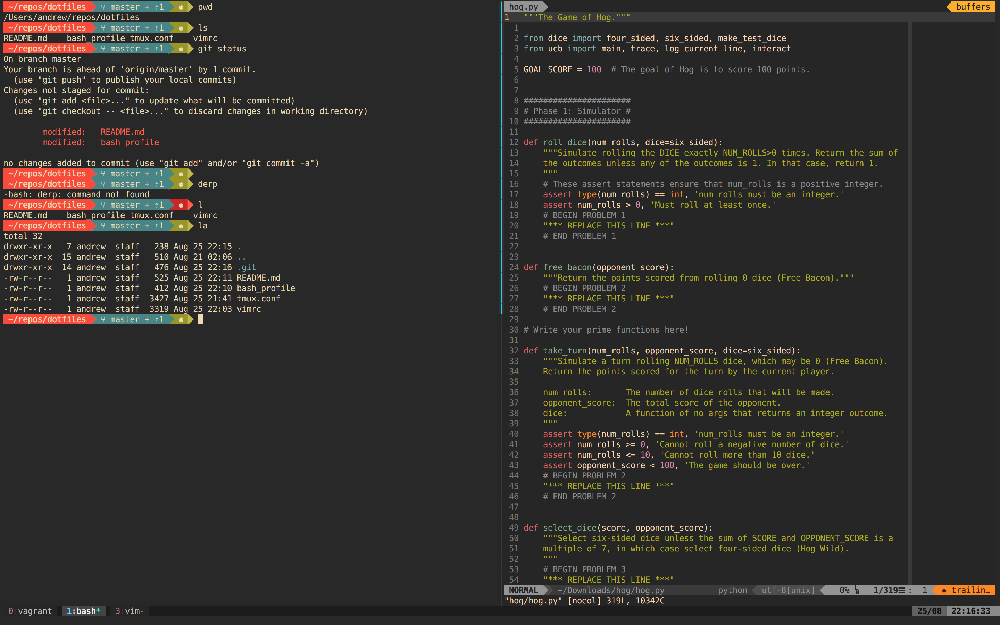

These are my dotfiles. There are many like them, but these are mine.

A few notes:
- I keep my repos under ~/code/src/github.com (I blame [Golang](https://golang.org/))
- I've remapped Caps Lock to Ctrl
- Set up [vim-plug](https://github.com/junegunn/vim-plug) in order to use the vimrc
- You'll need [The Silver Searcher](http://geoff.greer.fm/ag/) for [CtrlP](https://github.com/ctrlpvim/ctrlp.vim) to be happy
- The vim gruvbox theme probably requires a custom color palette for your terminal emulator
  - For example: https://github.com/flipxfx/gruvbox-terminal
- Find my forked version of bash-powerline [here](https://github.com/andrewhuang/bash-powerline)
  - (It just adds right triangle arrows a'la powerline)
  - You'll need [patched fonts](https://github.com/powerline/fonts) to display said arrows 

